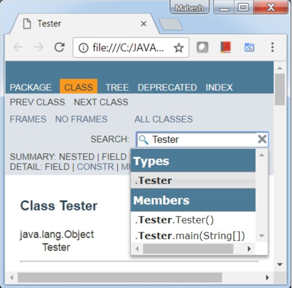

# ELK 教程

## 参考文档

[官网](https://www.elastic.co/cn/)

[ELK快速入门教程](https://www.jianshu.com/p/441298d8a9f6)

[Filebeat快速部署](https://www.jianshu.com/p/c7cc4091d1d1)

[Elasticsearch快速部署](https://www.jianshu.com/p/910e83880f98)

[Logstash快速部署](https://www.jianshu.com/p/42fd8f965db1)

[Kibana快速部署](https://www.jianshu.com/p/459b5b6551da)

[从 ELK 到 EFK](https://toutiao.io/posts/7fvyci/preview)

[创业公司做数据分析（四）ELK日志系统](https://zhuanlan.zhihu.com/p/26399963)

[ELK + Filebeat 搭建日志系统](https://zhuanlan.zhihu.com/p/312202332)

[ELK 实时日志分析平台环境搭建](https://zhuanlan.zhihu.com/p/32439193)

[企业级ELK-架构与部署（一）亲测可用！]()

[Elasticsearch基本概念及核心配置文件详解](https://www.cnblogs.com/xiaochina/p/6855591.html)

[慧凡ELK](http://showdoc.huifanayb.cn:4999/web/#/p/a71940d713a03168cda7da3ec884ca52)

[elastic中文社区](https://elasticsearch.cn/)

[Elasticsearch 权威指南](https://hezhiqiang.gitbook.io/elasticsearch/)

[]()

[]()

## 学习路线图


## 为什么做日志系统

### 什么是日志？

日志就是程序产生的，遵循一定格式（通常包含时间戳）的文本数据

通常日志由服务器生成，输出到不同的文件中

一般会有

* 系统日志
* 应用日志
* 安全日志

这些日志分散地存储在不同的机器上。

通常当系统发生故障时，工程师需要登录到各个服务器上，使用 `grep` / `sed` / `awk` 等 Linux 脚本工具去日志里查找故障原因。

在没有日志系统的情况下，

1. 首先需要定位处理请求的服务器，
2. 如果这台服务器部署了多个实例，则需要去每个应用实例的日志目录下去找日志文件。
3. 每个应用实例还会设置**日志滚动策略**（如：每天生成一个文件），还有**日志压缩归档策略**等。

如果我们能把这些日志集中管理，并提供集中检索功能，不仅可以提高诊断的效率，同时对系统情况有个全面的理解，避免事后救火的被动。

### 日志的作用

* 数据查找：通过检索日志信息，定位相应的 bug ，找出解决方案

* 服务诊断：通过对日志信息进行统计、分析，了解服务器的负荷和服务运行状态

* 数据分析：可以做进一步的数据分析，比如根据请求中的课程 id ，找出 TOP10 用户感兴趣课程。

## 一个完整的集中式日志系统，需要包含以下几个主要特点：

* 收集－能够采集多种来源的日志数据
* 传输－能够稳定的把日志数据传输到中央系统
* 存储－如何存储日志数据
* 分析－可以支持 UI 分析
* 警告－能够提供错误报告，监控机制

## ELK 组件

* Elasticsearch (核心引擎)
* Logstash (收集 较占资源)
* Kibana  (展示)
* Filebeat (轻量级收集器)

### Elasticsearch (核心引擎)

Elasticsearch是个开源分布式搜索引擎，提供搜集、分析、存储数据三大功能。

#### 特点

* 分布式
* 零配置
* 自动发现
* 索引自动分片
* 索引副本机制
* restful风格接口
* 多数据源
* 自动搜索负载等。

#### 与关系数据库对比

Elasticsearch 相当于一个NoSQL数据库

|Elasticsearch|Database|
|:---|:---|
|Index|Database|
|Type|Table|
|Document|Row|
|Field|Column|

#### Elasticsearch 基本概念

* 索引
* 映射
* 搜索

##### 索引

索引编制是添加数据 Elasticsearch 的过程。

之所以称为“索引”，是因为将数据输入到 Elasticsearch 中后，它将被放入 Apache Lucene 索引中。

然后，Elasticsearch 使用这些 Lucene 索引来存储和检索数据。

索引编制与 CRUD 操作的创建和更新过程相似。

> >   索引方案由 `名称`/`类型`/`id` 组成，其中**名称和类型是必填字段。** 如果您不提供任何 ID，Elasticsearch 将自己提供一个 ID。 然后，将整个查询附加到 HTTP PUT 请求中，最终 URL 如下：PUT name/type/id 与 HTTP 有效负载一起，还将发送包含字段和值的 JSON 文档。

以下是创建一个美国客户的文档的示例，该文档及其字段中的详细信息。

````
PUT /customer/US/1 
{
    "ID": 101,
    "FName": "James",
    "LName": "Butt",
    "Email": "jbutt@gmail.com",
    "City": "New Orleans",
    "Type": "VIP"
}

````

结果为

````
#! Deprecation: [types removal] Specifying types in document index requests is deprecated, use the typeless endpoints instead (/{index}/_doc/{id}, /{index}/_doc, or /{index}/_create/{id}).
{
  "_index" : "customer",
  "_type" : "US",
  "_id" : "1",
  "_version" : 1,
  "result" : "created",
  "_shards" : {
    "total" : 2,
    "successful" : 1,
    "failed" : 0
  },
  "_seq_no" : 0,
  "_primary_term" : 1
}

````

这里显示文档已创建并添加到索引中。 现在，如果您尝试在不更改标识的情况下更改字段详细信息，Elasticsearch 将使用当前详细信息覆盖现有文档。

````
PUT /customer/US/1
{
    "ID": 101,
    "FName": "James",
    "LName": "Butt",
    "Email": "jbutt@yahoo.com",
    "City": "Los Angeles",
    "Type": "VVIP"
}
````

##### 映射

映射是设置索引模式的过程。通过映射，您可以告诉 Elasticsearch 你的模式中属性的数据类型。**如果在预索引时未针对特定对象进行映射，则 Elasticsearch 将动态地将泛型类型添加到该字段。**
但是这些泛型类型是非常基本的，大多数时候都不能满足查询的期望。 现在让我们尝试映射查询。

````
PUT /customer/
{
    "mappings": {
        "US": {
            "properties": {
                "ID": {
                    "type": "long"
                },
                "FName": {
                    "type": "text"
                },
                "LName": {
                    "type": "text"
                },
                "Email": {
                    "type": "text"
                },
                "City": {
                    "type": "text"
                },
                "Type": {
                    "type": "text"
                }
            }
        }
    }
}

````

##### 搜索

具有特定索引和类型的一般搜索查询如下：

````
POST index/type/_search
````

现在，让我们尝试搜索“customer”索引中存在的所有客户的详细信息。

````
POST /customer/US/_search
````

当您要搜索特定结果时，Elasticsearch 提供了三种方法：

###### 使用查询

使用查询，您可以搜索一些特定的文档或条目。例如，让我们对属于“ VVIP”类别的客户执行搜索查询。

````
POST /customer/US/_search
{
    "query": {
        "match": {
            "Type": "VVIP"
        }
    }
}
````

###### 使用过滤器

使用过滤器，您可以进一步缩小搜索范围。以下是搜索 ID 为“ 101”的 VVIP 客户的示例：

````
POST /customer/_search
{
    "query": {
        "match": {
            "Type": "VVIP"
        }
    },
    "post_filter": {
        "match": {
            "ID": 101
        }
    }
}

````

###### 使用聚合

聚合是一个框架，可帮助通过搜索查询聚合数据。小型聚合可以结合在一起，以构建所提供数据的复杂摘要。让我们执行一个简单的汇总，以检查索引中有多少类型的客户：

````
POST /customer/_search
{
    "size": 0,
    "aggs": {
        "Cust_Types": {
            "terms": {
                "field": "Type.keyword"
            }
        }
    }
}

````

##### 获取数据

要检查索引中包含的文档列表，您只需要发送以下格式的 HTTP GET 请求：

````
GET index/type/id
````

让我们尝试检索“ id”等于 2 的客户的详细信息：

````
GET /customer/US/2

````

##### 删除数据

Elasticsearch，您不仅可以浏览数据，还可以删除或删除文档。

使用删除约定，您可以轻松地从索引中删除不需要的数据并释放内存空间。要删除任何文档，您需要以以下格式发送 HTTP DELETE 请求：

````
DELETE index/type/id.
````

现在让我们尝试删除 ID 为 2 的客户的详细信息。

````
DELETE /customer/US/2
````

### Logstash (收集 较占资源)

主要是用来日志的搜集、分析、过滤日志的工具，支持大量的数据获取方式。

一般工作方式为c/s架构

* client端安装在需要收集日志的主机上
* server端负责将收到的各节点日志进行过滤、修改等操作在一并发往elasticsearch上去。

Logstash 是一种管道工具，通常用于收集和转发日志或事件。它是一个开源数据收集引擎，可以动态集成来自各种来源的数据并将其标准化到指定的目标位置。

使用多个输入，过滤器和输出插件，Logstash 可以轻松转换各种事件。至少，Logstash 需要在其配置文件中指定的输入和输出插件来执行转换。以下是 Logstash 配置文件的结构：

````
input {
    ...
}

filter {
    ...
}

output {
    ...
}
````

如您所见，整个配置文件分为三个部分，每个部分都包含一个或多个插件的配置选项。这三个部分是：

1. input（输入）
2. filter （过滤）
3. output （输出）

您也可以在配置文件中应用多个过滤器。在这种情况下，其应用程序顺序将与配置文件中的规范顺序相同。 现在，让我们尝试配置 CSV 文件格式的美国客户数据集文件。

````
    file {
        path => "E:/ELK/data/US_Customer_List.csv"
        start_position => "beginning"
        sincedb_path => "/dev/null"
    }
}
filter {
    csv {
        separator => ","
        columns => ["Cust_ID", "Cust_Fname", "Cust_Lname", "Cust_Email", "Cust_City", "Cust_Type"]
    }
    mutate {
        convert => ["Cust_ID", "integer"]
    }
}
output {
    elasticsearch {
        hosts => "localhost"
        index => "customers"
        document_type => "US_Based_Cust"
    }
    stdout {}
}

````

要将这个 CSV 文件数据插入 elasticsearch 中，您必须通知 Logstash 服务器。 为此，请执行以下步骤：

打开命令提示符

进入 Logstash 的 bin 目录

输入：logstash –f X:/foldername/config_filename.config 然后按回车。

一旦您的 logstash 服务器启动并运行，它将开始将文件中的数据传输到Elasticsearch 中。

如果要检查是否成功插入了数据，请转到 Sense 插件并键入：GET /customers/ 它会为您提供已创建的文档数。 现在，如果要可视化此数据，则必须使用 ELK Stack
的最后一个工具，即Kibana。因此，在本教程的下一部分中，我将讨论 Kibana 及其使用方式，以可视化您的数据。

### Kibana  (展示)

Kibana 也是一个开源和免费的工具，Kibana可以为 Logstash 和 ElasticSearch 提供的日志分析友好的 Web 界面 可以帮助汇总、分析和搜索重要数据日志。

如前所述，Kibana 是一个开源的可视化和分析工具。它有助于可视化 Logstash 管道传输并存储到 Elasticsearch 中的数据。您可以使用 Kibana
来搜索，查看此存储的数据并与之交互，然后在各种图表，表格和地图中对其进行可视化。Kibana 的基于浏览器的界面简化了海量数据并反映了 Elasticsearch 查询中的实时变化。此外，您还可以轻松创建、自定义、保存和共享仪表板。

一旦您了解了如何与 Elasticsearch 和 Logstash 一起使用，学习 Kibana 就不是什么大事了。在本教程的这一部分，我将向您介绍为了对数据进行分析所需的各种功能。

#### 管理页面

在这里，您必须执行 Kibana 的运行时配置。 在此页面中，您需要指定一些搜索内容。请参见以下示例，在该示例中，我已经配置了“customer”索引的条目。



如您所见，在“索引模式（Index Patterns）”字段中，您需要指定要使用的索引。确保在“时间过滤器字段名称”中将其选择为**@timestamp**。然后，您可以继续并单击创建以创建索引。如果索引创建成功，您将看到以下页面类型：


在这里，您可以根据需要从下拉列表中选择不同的过滤器。此外，要释放内存，您还可以删除特定的索引。

#### 发现页面

通过“发现”页面，您可以访问存在于每个与所选索引模式匹配的每个索引的文档。 您可以轻松地交互和浏览Kibana服务器上存在的所有数据。 此外，您可以查看文档中存在的数据并对其进行搜索查询。 下面你可以看到，我正在搜索来自“洛杉矶”的“
VIP”客户。


因此，如您所见，我们只有一位来自洛杉矶的VIP客户。

#### 可视化页面

可视化页面使您可以可视化以图表、条形图、饼图等形式显示在 Elasticsearch 索引中的数据。您甚至可以在此处构建仪表板，这些仪表板将基于 Elasticsearch查询显示相关的可视化效果。通常，使用一系列
Elasticsearch 聚合查询来提取和处理数据。当您转到“可视化”页面并搜索保存的可视化时，或者可以创建一个新的可视化。


您可以以任何形式汇总数据。为了方便用户，提供了不同类型的可视化选项。


让我向您展示如何根据用户类型可视化美国客户数据。


要执行可视化，请按照以下步骤操作：

* 选择可视化类型。 [这里我用的是饼图]
* 在汇总字段中，从下拉列表中选择“术语（term）”。
* 在“字段（field）”中，选择要执行搜索的字段类型。
* 您还可以指定可视化的顺序和大小。
* 现在单击执行按钮以生成饼图。

#### 仪表板页面

“仪表板”页面显示已保存的可视化的集合。在这里，您可以添加新的可视化效果，也可以使用任何保存的可视化效果。


#### Timelion 页面

Timelion 是一个时间序列数据可视化工具，它将完全独立的数据源整合到一个界面中。 它由一种单行表达语言驱动，可用于检索时间序列数据，执行计算以简化复杂问题并可视化结果。


#### 开发工具页面

Kibana 的“开发工具”页面包含诸如“ Beta Sense”插件之类的开发工具，可用于与 Elasticsearch 中存在的数据进行交互。它通常被称为 Kibana 的控制台。以下是一个示例，其中我使用了 Kibana 的
Sense 插件来搜索类型为“ US_based_cust”的“客户（customers）”索引：


### Filebeat (轻量级收集器)

一个轻量级的日志收集处理工具(Agent)，占用资源少，适合于在各个服务器上搜集日志后传输给Logstash

基于原先 Logstash-fowarder 的源码改造出来。换句话说：Filebeat就是新版的 Logstash-fowarder，也会是 ELK Stack 在 shipper 端的第一选择。

## 架构原理

### 简单版架构


这种架构下我们把 Logstash 实例与 Elasticsearch 实例直接相连。Logstash 实例直接通过 Input 插件读取数据源数据(比如 Java 日志， Nginx 日志等)，经过 Filter
插件进行过滤日志，最后通过 Output 插件将数据写入到 ElasticSearch 实例中。

这个阶段，日志的收集、过滤、输出等功能，主要由这三个核心组件组成

1. Input
2. Filter
3. Output

#### Input：输入

输入数据可以是

* File
* Stdin（直接从控制台输入）
* TCP
* Syslog
* Redis
* Collectd

#### Filter：过滤，将日志输出成我们想要的格式。

Logstash 存在丰富的过滤插件：

**Grok** 正则捕获、时间处理、JSON 编解码、数据修改 Mutate 。

Grok 是 Logstash 中最重要的插件，

强烈建议每个人都要使用 Grok Debugger 来调试自己的 Grok 表达式

#### Output：输出

输出目标可以是

* Stdout （直接从控制台输出）
* Elasticsearch
* Redis
* TCP
* File

#### 适用场景

这是最简单的一种ELK架构方式，Logstash 实例直接与 Elasticsearch 实例连接。优点是搭建简单，易于上手。建议供初学者学习与参考，不能用于线上的环境。

### 集群版架构


这种架构下我们采用多个 Elasticsearch 节点组成 Elasticsearch 集群，由于 Logstash 与 Elasticsearch 采用集群模式运行，集群模式可以避免单实例压力过重的问题，同时在线上各个服务器上部署
Logstash Agent，来满足数据量不大且可靠性不强的场景。

> > **数据收集端**：每台服务器上面部署 Logstash Shipper Agent 来收集当前服务器上日志，日志经过 Logstash Shipper 中 Input插件、Filter插件、Output 插件传输到 Elasticsearch 集群

> > **数据存储与搜索**：Elasticsearch 配置默认即可满足，同时我们看数据重要性来决定是否添加副本，如果需要的话，最多一个副本即可

> > *数据展示**：Kibana 可以根据 Elasticsearch 的数据来做各种各样的图表来直观的展示业务实时状况

#### 存在问题

这种架构使用场景非常有限，主要存在以下两个问题

* **消耗服务器资源**：Logstash 的收集、过滤都在服务器上完成，这就造成服务器上占用系统资源较高、性能方面不是很好，调试、跟踪困难，异常处理困难

* **数据丢失**：大并发情况下，由于日志传输峰值比较大，没有消息队列来做缓冲，就会导致 Elasticsearch 集群丢失数据。原因为日志收集能力大于日志处理能力时。

#### 适用场景

这个架构相对上个版本略微复杂，不过维护起来同样比较方便，同时可以满足**数据量不大且可靠性不强**的业务使用。

### 引入消息队列


#### 为什么引入消息队列

解决数据丢失问题

该场景下:

1. 多个数据首先通过 Lostash Shipper Agent 来收集数据，
2. 然后经过 Output 插件将数据投递到 Kafka 集群中
3. 这样当遇到 Logstash 接收数据的能力超过 Elasticsearch 集群处理能力的时候，就可以通过队列就能起到削峰填谷的作用， Elasticsearch 集群就不存在丢失数据的问题。

#### 队列插件选择

目前业界在日志服务场景中，使用比较多的两种消息队列为 ：Kafka VS Redis。尽管 ELK Stack 官网建议使用 Redis 来做消息队列，但是我们建议采用 Kafka 。主要从下面两个方面考虑：

* **数据丢失**：Redis 队列多用于实时性较高的消息推送，并不保证可靠。Kafka保证可靠但有点延时。

* **数据堆积**：Redis 队列容量取决于机器内存大小，如果超过设置的Max memory，数据就会抛弃。Kafka 的堆积能力取决于机器硬盘大小。

#### 存在的问题

综合上述的理由，我们决定采用 Kafka 来缓冲队列。不过在这种架构下仍然存在一系列问题

* Logstash shipper 收集数据同样会消耗 CPU 和内存资源

* **不支持多机房部署**

#### 适用场景

这种架构适合较大集群的应用部署 通过消息队列解决了

* 消息丢失的问题
* 网络堵塞的问题

### 多机房部署


#### 原因 业务发展

随着业务的飞速增长，单机房的架构已经不能满足需求。不可避免的，业务需要分布到不同机房中，对于日志服务来说也是不小的挑战。

#### 业界成熟解决方案

当然业界也有不少成熟的方法

* 比如阿里的**单元化**
* 腾讯的 **SET 方案**

单元化在这边不详细展开，大家可以参考微博的【单元化架构】。

#### 实现方案

* 采用单元化部署的方式来解决 ELK 多机房中遇到的问题(延时、专线流量过大等)
* 从日志的产生、收集、传输、存储、展示都是在**同机房里面闭环消化**
* 不存在跨机房传输与调用的问题。因为**交互紧密的应用尽量部署在同机房**，所以这种方案并不会给业务查询造成困扰。

* Logstash、Elasticsearch、Kafka、Kibana 四个集群都部署到同一机房中
* 每个机房都要每个机房自己的日志服务集群，
    1. 比如A机房业务的日志只能传输给本机房 Kafka
    2. 而A机房 Indexer 集群消费并写入到A机房 Elasticsearch 集群中
    3. 并由A机房 Kibana 集群展示，中间任何一个步骤不依赖B机房任何服务。

### 使用filebeat+缓存+logstash+es+kibana架构


Filebeat 是基于原先 logstash-forwarder 的源码改造出来的，无需依赖 Java 环境就能运行，安装包10M不到。

#### 为什么用

如果日志的量很大，**Logstash 会遇到资源占用高的问题**，为解决这个问题，我们引入了Filebeat。Filebeat 是基于 logstash-forwarder 的源码改造而成，用 Golang 编写，无需依赖 Java
环境，效率高，占用内存和 CPU 比较少，非常适合作为 Agent 跑在服务器上。

#### 用法

下面看看Filebeat的基本用法。编写配置文件，从 Nginx access.log 中解析日志数据：

````
# filebeat.yml
filebeat.prospectors:
- input_type: log
  paths: /var/log/nginx/access.log
  json.message_key:

output.elasticsearch:
  hosts: ["localhost"]
  index: "filebeat-nginx-%{+yyyy.MM.dd}"
````

我们来看看压测数据：

#### 压测环境

* 虚拟机 8 cores 64G内存 540G SATA盘

* Logstash 版本 2.3.1

* Filebeat 版本 5.5.0

#### 压测方案

Logstash / Filebeat 读取 350W 条日志 到 console，单行数据 580B，8个进程写入采集文件

#### 压测结果

|**项目**|workers|    cpu |usr总共耗时    |收集速度|
|:---|:---|:---|:---|:---|
|Logstash    |8|    53.7%    |210s    |1.6w line/s|
|Filebeat    |8|    38.0%    |30s    |11w line/s|

Filebeat 所消耗的CPU只有 Logstash 的70%，但收集速度为 Logstash 的7倍。从我们的应用实践来看，Filebeat 确实用较低的成本和稳定的服务质量，解决了 Logstash 的资源消耗问题。

#### 经验教训

最后，分享给大家一些血泪教训，希望大家以我为鉴。

*
    1. Indexer 运行一段时间后自动挂掉 突然有一天监控发现日志不消费了，排查下来发现消费 Kafka 数据的 indexer 挂掉了。所以，Indexer 进程也是需要用 **supervisor**
       来监控的，保证它时刻都在运行。

*
    2. Java异常日志输出 开始我们在通过 grok 切割日志的时候，发现 Java 的 Exception 日志输出之后，会出现换行的问题。后来使用 **Logstash codec/multiline** 插件来解决。

````
input {
    stdin {
        codec => multiline {
            pattern => "^\["
            negate => true
            what => "previous"
        }
    }
}
````

*
    3. 由于时区导致日志8小时时差 Logstash 2.3版本 date插件配置如下，查看解析结果发现@timestamp比中国时间早了8小时。

解决方案 Kibana 读取浏览器的当前时区，然后在页面上转换时间内容的显示。

````
date {
    match => [ "log_timestamp", "YYYY-MM-dd HH:mm:ss.SSS" ]
    target => "@timestamp"
  }
````

* 4.Grok parse failure 我们遇到线上 node 日志突然有几天日志查看不出来。后来拉出原始日志对比才发现生成出来的日志格式不正确，同时包含 JSON 格式和非 JSON 格式的日志。但是我们用grok解析的时候采用是
  json 格式。建议大家输出日志保证格式一致同时不要出现空格等异常字符，可以使用在线 grok debug (http://grokdebug.herokuapp.com/) 来调试正则。

#### 总结

基于 ELK stack 的日志解决方案的优势主要体现于：

* 可扩展性：采用高可扩展性的分布式系统架构设计，可以支持每日 TB 级别的新增数据。

* 使用简单：通过用户图形界面实现各种统计分析功能，简单易用，上手快

* 快速响应：从日志产生到查询可见，能达到秒级完成数据的采集、处理和搜索统计。

* 界面炫丽：Kibana 界面上，只需要点击鼠标，就可以完成搜索、聚合功能，生成炫丽的仪表板。

## mac 安装

### 安装 elasticsearch

````
 brew install elasticsearch
````

#### 启动

````
brew services start elasticsearch
````

#### 访问

````
在浏览器输入
http://localhost:9200/
````

### 安装 Logstash

````        
 brew install Logstash
````        

#### 启动

````
brew services start Logstash
````

### 安装 filebeat

````        
 brew install filebeat
````        

### 安装 kibana

````        
 brew install kibana
````        

#### 启动

````
 brew services start kibana
````

#### 访问

````
在浏览器输入
http://localhost:5601
````

### 安装 kafka

````        
 brew install kafka
````        

## Elasticsearch基本概念及核心配置文件详解

Elasticsearch5.X,下列的是Elasticsearch2.X系类配置，其实很多配置都是相互兼容的

### 1. 配置文件

````
config/elasticsearch.yml   主配置文件
config/jvm.options         jvm参数配置文件
cofnig/log4j2.properties   日志配置文件
````

### 2. 基本概念

#### 接近实时（NRT）

Elasticsearch 是一个**接近实时的搜索平台**。这意味着，从索引一个文档直到这个文档能够被搜索到有一个很小的延迟（通常是 1 秒）。

#### 集群（cluster）

代表一个集群，集群中有多个节点（node），其中有一个为主节点，这个**主节点是可以通过选举产生的**，主从节点是对于集群内部来说的。**es的一个概念就是去中心化，字面上理解就是无中心节点**
，这是对于集群外部来说的，因为从外部来看es集群，在逻辑上是个整体，你与任何一个节点的通信和与整个es集群通信是等价的。

#### 索引（index）

ElasticSearch将它的数据存储在一个或多个索引（index）中。用SQL领域的术语来类比，索引就像数据库，可以向索引写入文档或者从索引中读取文档，并通过ElasticSearch内部使用Lucene将数据写入索引或从索引中检索数据。

#### 文档（document）

文档（document）是ElasticSearch中的主要实体。对所有使用ElasticSearch的案例来说，他们最终都可以归结为对文档的搜索。文档由字段构成。

#### 映射（mapping）

所有文档写进索引之前都会先进行分析，如何将输入的文本分割为词条、哪些词条又会被过滤，这种行为叫做映射（mapping）。一般由用户自己定义规则。

#### 类型（type）

每个文档都有与之对应的类型（type）定义。这允许用户在一个索引中存储多种文档类型，并为不同文档提供类型提供不同的映射。

#### 分片（shards）

代表索引分片，es可以把一个完整的索引分成多个分片，这样的好处是可以把一个大的索引拆分成多个，分布到不同的节点上。构成分布式搜索。分片的数量只能在索引创建前指定，并且索引创建后不能更改。5.X默认不能通过配置文件定义分片

#### 副本（replicas）

代表索引副本，es可以设置多个索引的副本，**副本的作用一是提高系统的容错性**，当个某个节点某个分片损坏或丢失时可以从副本中恢复。二是提高es的查询效率，es会自动对搜索请求进行负载均衡。

#### 数据恢复（recovery）

* 代表数据恢复或叫数据重新分布，**es在有节点加入或退出时会根据机器的负载对索引分片进行重新分配**，挂掉的节点重新启动时也会进行数据恢复。
* GET /_cat/health?v #可以看到集群状态

#### 数据源（River）

代表es的一个数据源，也是其它存储方式（如：数据库）同步数据到es的一个方法。它是以插件方式存在的一个es服务，通过读取river中的数据并把它索引到es中，官方的river有couchDB的，RabbitMQ的，Twitter的，Wikipedia的，river这个功能将会在后面的文件中重点说到。

#### 网关（gateway）

代表es索引的持久化存储方式，**es默认是先把索引存放到内存中，当内存满了时再持久化到硬盘**
。当这个es集群关闭再重新启动时就会从gateway中读取索引数据。es支持多种类型的gateway，有本地文件系统（默认），分布式文件系统，Hadoop的HDFS和amazon的s3云存储服务。

#### 自动发现（discovery.zen）

* 代表es的自动发现节点机制，**es是一个基于p2p的系统**，它先通过广播寻找存在的节点，再通过多播协议来进行节点之间的通信，同时也支持点对点的交互。
* 5.X关闭广播，需要自定义

#### 通信（Transport）

* 代表**es内部节点或集群与客户端的交互方式，默认内部是使用tcp协议进行交互**，同时它支持http协议（json格式）、thrift、servlet、memcached、zeroMQ等的传输协议（通过插件方式集成）。
* 节点间通信端口默认：9300-9400

#### 分片和复制（shards and replicas）

一个索引可以存储超出单个结点硬件限制的大量数据。比如，一个具有10亿文档的索引占据1TB的磁盘空间，而任一节点可能没有这样大的磁盘空间来存储或者单个节点处理搜索请求，响应会太慢。

为了解决这个问题，Elasticsearch提供了将索引划分成多片的能力，这些片叫做分片。当你创建一个索引的时候，你可以指定你想要的分片的数量。每个分片本身也是一个功能完善并且独立的“索引”，这个“索引” 可以被放置到集群中的任何节点上。

分片之所以重要，主要有两方面的原因：

* 允许你水平分割/扩展你的内容容量
* 允许你在分片（位于多个节点上）之上进行分布式的、并行的操作，进而提高性能/吞吐量

至于一个分片怎样分布，它的文档怎样聚合回搜索请求，是完全由Elasticsearch管理的，对于作为用户的你来说，这些都是透明的。
在一个网络/云的环境里，失败随时都可能发生。在某个分片/节点因为某些原因处于离线状态或者消失的情况下，故障转移机制是非常有用且强烈推荐的。为此， **
Elasticsearch允许你创建分片的一份或多份拷贝，这些拷贝叫做复制分片，或者直接叫复制。**

复制之所以重要，有两个主要原因：

* 在分片/节点失败的情况下，复制提供了高可用性。复制分片不与原/主要分片置于同一节点上是非常重要的。因为搜索可以在所有的复制上并行运行，复制可以扩展你的搜索量/吞吐量
* 总之，每个索引可以被分成多个分片。一个索引也可以被复制0次（即没有复制） 或多次。一旦复制了，每个索引就有了主分片（作为复制源的分片）和复制分片（主分片的拷贝）。
* 分片和复制的数量可以在索引创建的时候指定。在索引创建之后，你可以在任何时候动态地改变复制的数量，但是你不能再改变分片的数量。
* 5.X默认5:1 5个主分片，1个复制分片

默认情况下，**Elasticsearch中的每个索引分配5个主分片和1个复制**。这意味着，如果你的集群中至少有两个节点，你的索引将会有5个主分片和另外5个复制分片（1个完全拷贝），这样每个索引总共就有10个分片。

### 3. elasticsearch.yml 详解

````

##################### Elasticsearch Configuration Example ##################### 
#
# 只是挑些重要的配置选项进行注释,其实自带的已经有非常细致的英文注释了!
# https://www.elastic.co/guide/en/elasticsearch/reference/current/modules.html
#
################################### Cluster ################################### 
# 代表一个集群,集群中有多个节点,其中有一个为主节点,这个主节点是可以通过选举产生的,主从节点是对于集群内部来说的. 
# es的一个概念就是去中心化,字面上理解就是无中心节点,这是对于集群外部来说的,因为从外部来看es集群,在逻辑上是个整体,你与任何一个节点的通信和与整个es集群通信是等价的。 
# cluster.name可以确定你的集群名称,当你的elasticsearch集群在同一个网段中elasticsearch会自动的找到具有相同cluster.name的elasticsearch服务. 
# 所以当同一个网段具有多个elasticsearch集群时cluster.name就成为同一个集群的标识. 

# cluster.name: elasticsearch 

#################################### Node ##################################### 
# https://www.elastic.co/guide/en/elasticsearch/reference/5.1/modules-node.html#master-node
# 节点名称同理,可自动生成也可手动配置. 
# node.name: node-1

# 允许一个节点是否可以成为一个master节点,es是默认集群中的第一台机器为master,如果这台机器停止就会重新选举master. 
# node.master: true 

# 允许该节点存储数据(默认开启) 
# node.data: true 

# 配置文件中给出了三种配置高性能集群拓扑结构的模式,如下： 
# 1. 如果你想让节点从不选举为主节点,只用来存储数据,可作为负载器 
# node.master: false 
# node.data: true 
# node.ingest: true  #默认true

# 2. 如果想让节点成为主节点,且不存储任何数据,并保有空闲资源,可作为协调器 
# node.master: true 
# node.data: false
# node.ingest: true

# 3. 如果想让节点既不称为主节点,又不成为数据节点,那么可将他作为搜索器,从节点中获取数据,生成搜索结果等 
# node.master: false 
# node.data: false 
# node.ingest: true
#

# 4. 仅作为协调器 
# node.master: false 
# node.data: false
# node.ingest: false

# 监控集群状态有一下插件和API可以使用: 
# Use the Cluster Health API [http://localhost:9200/_cluster/health], the 
# Node Info API [http://localhost:9200/_nodes] or GUI tools # such as <http://www.elasticsearch.org/overview/marvel/>, 


# A node can have generic attributes associated with it, which can later be used 
# for customized shard allocation filtering, or allocation awareness. An attribute 
# is a simple key value pair, similar to node.key: value, here is an example: 
# 每个节点都可以定义一些与之关联的通用属性，用于后期集群进行碎片分配时的过滤
# node.rack: rack314 

# 默认情况下，多个节点可以在同一个安装路径启动，如果你想让你的es只启动一个节点，可以进行如下设置
# node.max_local_storage_nodes: 1 

#################################### Index #################################### 
# 设置索引的分片数,默认为5 
#index.number_of_shards: 5 

# 设置索引的副本数,默认为1: 
#index.number_of_replicas: 1 

# 配置文件中提到的最佳实践是,如果服务器够多,可以将分片提高,尽量将数据平均分布到大集群中去
# 同时,如果增加副本数量可以有效的提高搜索性能 
# 需要注意的是,"number_of_shards" 是索引创建后一次生成的,后续不可更改设置 
# "number_of_replicas" 是可以通过API去实时修改设置的 

#################################### Paths #################################### 
# 配置文件存储位置 
# path.conf: /path/to/conf 

# 数据存储位置(单个目录设置) 
# path.data: /path/to/data 
# 多个数据存储位置,有利于性能提升 
# path.data: /path/to/data1,/path/to/data2 

# 临时文件的路径 
# path.work: /path/to/work 

# 日志文件的路径 
# path.logs: /path/to/logs 

# 插件安装路径 
# path.plugins: /path/to/plugins 

#################################### Plugin ################################### 
# 设置插件作为启动条件,如果一下插件没有安装,则该节点服务不会启动 
# plugin.mandatory: mapper-attachments,lang-groovy 

################################### Memory #################################### 
# 当JVM开始写入交换空间时（swapping）ElasticSearch性能会低下,你应该保证它不会写入交换空间 
# 设置这个属性为true来锁定内存,同时也要允许elasticsearch的进程可以锁住内存,linux下可以通过 `ulimit -l unlimited` 命令 
# bootstrap.mlockall: true 

# 确保 ES_MIN_MEM 和 ES_MAX_MEM 环境变量设置为相同的值,以及机器有足够的内存分配给Elasticsearch 
# 注意:内存也不是越大越好,一般64位机器,最大分配内存别才超过32G 

############################## Network And HTTP ############################### 
# 设置绑定的ip地址,可以是ipv4或ipv6的,默认为0.0.0.0 
# network.bind_host: 192.168.0.1   #只有本机可以访问http接口

# 设置其它节点和该节点交互的ip地址,如果不设置它会自动设置,值必须是个真实的ip地址 
# network.publish_host: 192.168.0.1 

# 同时设置bind_host和publish_host上面两个参数 
# network.host: 192.168.0.1    #绑定监听IP

# 设置节点间交互的tcp端口,默认是9300 
# transport.tcp.port: 9300 

# 设置是否压缩tcp传输时的数据，默认为false,不压缩
# transport.tcp.compress: true 

# 设置对外服务的http端口,默认为9200 
# http.port: 9200 

# 设置请求内容的最大容量,默认100mb 
# http.max_content_length: 100mb 

# 使用http协议对外提供服务,默认为true,开启 
# http.enabled: false 

###################### 使用head等插件监控集群信息，需要打开以下配置项 ###########
# http.cors.enabled: true
# http.cors.allow-origin: "*"
# http.cors.allow-credentials: true

################################### Gateway ################################### 
# gateway的类型,默认为local即为本地文件系统,可以设置为本地文件系统 
# gateway.type: local 

# 下面的配置控制怎样以及何时启动一整个集群重启的初始化恢复过程 
# (当使用shard gateway时,是为了尽可能的重用local data(本地数据)) 

# 一个集群中的N个节点启动后,才允许进行恢复处理 
# gateway.recover_after_nodes: 1 

# 设置初始化恢复过程的超时时间,超时时间从上一个配置中配置的N个节点启动后算起 
# gateway.recover_after_time: 5m 

# 设置这个集群中期望有多少个节点.一旦这N个节点启动(并且recover_after_nodes也符合), 
# 立即开始恢复过程(不等待recover_after_time超时) 
# gateway.expected_nodes: 2

 ############################# Recovery Throttling ############################# 
# 下面这些配置允许在初始化恢复,副本分配,再平衡,或者添加和删除节点时控制节点间的分片分配 
# 设置一个节点的并行恢复数 
# 1.初始化数据恢复时,并发恢复线程的个数,默认为4 
# cluster.routing.allocation.node_initial_primaries_recoveries: 4 

# 2.添加删除节点或负载均衡时并发恢复线程的个数,默认为2 
# cluster.routing.allocation.node_concurrent_recoveries: 2 

# 设置恢复时的吞吐量(例如:100mb,默认为0无限制.如果机器还有其他业务在跑的话还是限制一下的好) 
# indices.recovery.max_bytes_per_sec: 20mb 

# 设置来限制从其它分片恢复数据时最大同时打开并发流的个数,默认为5 
# indices.recovery.concurrent_streams: 5 
# 注意: 合理的设置以上参数能有效的提高集群节点的数据恢复以及初始化速度 

################################## Discovery ################################## 
# 设置这个参数来保证集群中的节点可以知道其它N个有master资格的节点.默认为1,对于大的集群来说,可以设置大一点的值(2-4) 
# discovery.zen.minimum_master_nodes: 1 
# 探查的超时时间,默认3秒,提高一点以应对网络不好的时候,防止脑裂 
# discovery.zen.ping.timeout: 3s 

# For more information, see 
# <http://elasticsearch.org/guide/en/elasticsearch/reference/current/modules-discovery-zen.html> 

# 设置是否打开多播发现节点.默认是true. 
# 当多播不可用或者集群跨网段的时候集群通信还是用单播吧 
# discovery.zen.ping.multicast.enabled: false 

# 这是一个集群中的主节点的初始列表,当节点(主节点或者数据节点)启动时使用这个列表进行探测 
# discovery.zen.ping.unicast.hosts: ["host1", "host2:port"] 

# Slow Log部分与GC log部分略,不过可以通过相关日志优化搜索查询速度 

################  X-Pack ###########################################
# 官方插件 相关设置请查看此处
# https://www.elastic.co/guide/en/x-pack/current/xpack-settings.html
# 
############## Memory(重点需要调优的部分) ################ 
# Cache部分: 
# es有很多种方式来缓存其内部与索引有关的数据.其中包括filter cache 

# filter cache部分: 
# filter cache是用来缓存filters的结果的.默认的cache type是node type.node type的机制是所有的索引内部的分片共享filter cache.node type采用的方式是LRU方式.即:当缓存达到了某个临界值之后，es会将最近没有使用的数据清除出filter cache.使让新的数据进入es. 

# 这个临界值的设置方法如下：indices.cache.filter.size 值类型：eg.:512mb 20%。默认的值是10%。 

# out of memory错误避免过于频繁的查询时集群假死 
# 1.设置es的缓存类型为Soft Reference,它的主要特点是据有较强的引用功能.只有当内存不够的时候,才进行回收这类内存,因此在内存足够的时候,它们通常不被回收.另外,这些引用对象还能保证在Java抛出OutOfMemory异常之前,被设置为null.它可以用于实现一些常用图片的缓存,实现Cache的功能,保证最大限度的使用内存而不引起OutOfMemory.在es的配置文件加上index.cache.field.type: soft即可. 

# 2.设置es最大缓存数据条数和缓存失效时间,通过设置index.cache.field.max_size: 50000来把缓存field的最大值设置为50000,设置index.cache.field.expire: 10m把过期时间设置成10分钟. 
# index.cache.field.max_size: 50000 
# index.cache.field.expire: 10m 
# index.cache.field.type: soft 

# field data部分&&circuit breaker部分： 
# 用于fielddata缓存的内存数量,主要用于当使用排序,faceting操作时,elasticsearch会将一些热点数据加载到内存中来提供给客户端访问,但是这种缓存是比较珍贵的,所以对它进行合理的设置. 

# 可以使用值：eg:50mb 或者 30％(节点 node heap内存量),默认是：unbounded #indices.fielddata.cache.size： unbounded 
# field的超时时间.默认是-1,可以设置的值类型: 5m #indices.fielddata.cache.expire: -1 

# circuit breaker部分: 
# 断路器是elasticsearch为了防止内存溢出的一种操作,每一种circuit breaker都可以指定一个内存界限触发此操作,这种circuit breaker的设定有一个最高级别的设定:indices.breaker.total.limit 默认值是JVM heap的70%.当内存达到这个数量的时候会触发内存回收

# 另外还有两组子设置： 
#indices.breaker.fielddata.limit:当系统发现fielddata的数量达到一定数量时会触发内存回收.默认值是JVM heap的70% 
#indices.breaker.fielddata.overhead:在系统要加载fielddata时会进行预先估计,当系统发现要加载进内存的值超过limit * overhead时会进行进行内存回收.默认是1.03 
#indices.breaker.request.limit:这种断路器是elasticsearch为了防止OOM(内存溢出),在每次请求数据时设定了一个固定的内存数量.默认值是40% 
#indices.breaker.request.overhead:同上,也是elasticsearch在发送请求时设定的一个预估系数,用来防止内存溢出.默认值是1 

# Translog部分: 
# 每一个分片(shard)都有一个transaction log或者是与它有关的预写日志,(write log),在es进行索引(index)或者删除(delete)操作时会将没有提交的数据记录在translog之中,当进行flush 操作的时候会将tranlog中的数据发送给Lucene进行相关的操作.一次flush操作的发生基于如下的几个配置 
#index.translog.flush_threshold_ops:当发生多少次操作时进行一次flush.默认是 unlimited #index.translog.flush_threshold_size:当translog的大小达到此值时会进行一次flush操作.默认是512mb 
#index.translog.flush_threshold_period:在指定的时间间隔内如果没有进行flush操作,会进行一次强制flush操作.默认是30m #index.translog.interval:多少时间间隔内会检查一次translog,来进行一次flush操作.es会随机的在这个值到这个值的2倍大小之间进行一次操作,默认是5s 
#index.gateway.local.sync:多少时间进行一次的写磁盘操作,默认是5s 

# 以上的translog配置都可以通过API进行动态的设置 - See more at: http://bigbo.github.io/pages/2015/04/10/elasticsearch_config/#sthash.AvOSUcQ4.dpuf
````

