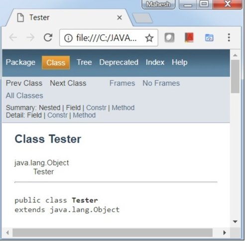

javadoc 工具可以生成 Java 文档， Java 9 的 javadoc 的输出现在符合兼容 HTML5 标准。

Java 9 之前的旧版本文档

考虑以下文件代码 C:/JAVA/Tester.java:
````
/**
  * @author MahKumar
  * @version 0.1
*/
public class Tester {
   /**
      * Default method to be run to print 
      * <p>Hello world</p>
      * @param args command line arguments
   */
   public static void main(String []args) {
      System.out.println("Hello World");
   }
}

````
使用 jdk 7 的 javadoc 生成文档：
````
C:\JAVA>javadoc -d C:/JAVA Tester.java
Loading source file tester.java...
Constructing Javadoc information...
Standard Doclet version 1.7.0_21
Building tree for all the packages and classes...
Generating C:\JAVA\Tester.html...
Generating C:\JAVA\package-frame.html...
Generating C:\JAVA\package-summary.html...
Generating C:\JAVA\package-tree.html...
Generating C:\JAVA\constant-values.html...
Building index for all the packages and classes...
Generating C:\JAVA\overview-tree.html...
Generating C:\JAVA\index-all.html...
Generating C:\JAVA\deprecated-list.html...
Building index for all classes...
Generating C:\JAVA\allclasses-frame.html...
Generating C:\JAVA\allclasses-noframe.html...
Generating C:\JAVA\index.html...
Generating C:\JAVA\help-doc.html...

````
执行以上命令会再 C:/JAVA 命令下生成文档页面，如下图所示：


Java 9 生成的文档兼容 HTML5 标准

使用 jdk 9 javadoc 命令中的 -html5 参数可以让生成的文档支持 HTML5 标准：

````
C:\JAVA> javadoc -d C:/JAVA -html5 Tester.java
Loading source file Tester.java...
Constructing Javadoc information...
Standard Doclet version 9.0.1
Building tree for all the packages and classes...
Generating C:\JAVA\Tester.html...
Generating C:\JAVA\package-frame.html...
Generating C:\JAVA\package-summary.html...
Generating C:\JAVA\package-tree.html...
Generating C:\JAVA\constant-values.html...
Building index for all the packages and classes...
Generating C:\JAVA\overview-tree.html...
Generating C:\JAVA\index-all.html...
Generating C:\JAVA\deprecated-list.html...
Building index for all classes...
Generating C:\JAVA\allclasses-frame.html...
Generating C:\JAVA\allclasses-frame.html...
Generating C:\JAVA\allclasses-noframe.html...
Generating C:\JAVA\allclasses-noframe.html...
Generating C:\JAVA\index.html...
Generating C:\JAVA\help-doc.html...

````
执行以上命令会再 C:/JAVA 命令下生成文档页面，如下图所示：


